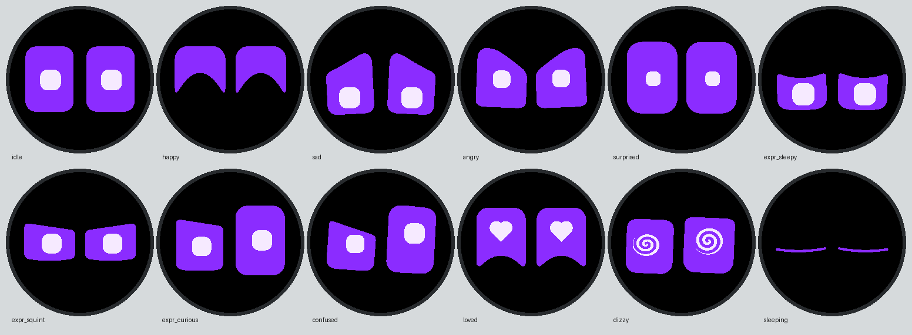

# Star Face

A wearable eye pet for the **Waveshare ESP32-S3-Touch-LCD-1.28**, adapted from [CREATURE's Starboy](https://hesjustalittleguy.com/) behaviors to the sensors in this board. The round 240 × 240 screen shows two large robot-style eyes on pure black, drawn with **exactly two colours**: a violet eye shape and a pale lilac pupil. There are no gradients, glows, shadows or anti-aliased in-between pixels. The eyes themselves deform to carry the expressions: lids slant, curve and close, outlines stretch, tilt and bend into crescents, and pupils shrink, grow, turn into hearts or spin into spirals. There is no mouth. The face is drawn procedurally on the device from smooth vector shapes and needs no image files, Wi-Fi, or cloud service. [Front-view preview](face-preview.svg) ([PNG](face-preview.png)).



The design borrows from open robot-eye projects: [FluxGarage RoboEyes](https://github.com/FluxGarage/RoboEyes) (rounded-box eyes, mood lids, curious eye growth when looking sideways) and [esp32-eyes](https://github.com/playfultechnology/esp32-eyes) (each expression is a set of shape parameters, and the eyes blend between them).

## What it does

- Starts with closed eyes, slowly opens them, looks left and right, then looks forward. Idle glances cover the cardinal and diagonal directions, with tiny drift, irregular blinks, and occasional double blinks.
- Pupils follow the board's tilt using its QMI8658 motion sensor. The pupils lead and the whole eyes follow a beat later; the second eye trails a fraction behind the first, fast moves squash and stretch the eyes slightly, and the eye on the side being looked toward grows a little (curious), so gaze reads as a small head turn. Left alone it looks around, blinks at random (with doubles, half blinks and slow blinks) and shows brief micro-expressions: a squint, a curious lift, a sceptical look.
- **Touch:** while a finger is on the screen the eyes follow it wherever it moves. A tap makes the nearer eye flinch first, then both rebound and settle; a double tap surprises them; three quick taps make them dart anxiously; **four quick taps** make it fall in love (heart pupils). A short gentle press is a pet (happy crescent eyes). **Holding on annoys it**: after about a second the lids lower, then it glares at your finger and trembles; let go and it huffs, then cools off over a few seconds.
- A swipe pulls and stretches the eyes in its direction, then releases them into an expression. The direction is taken from **the last flick of your finger** before it lifts, so you can press anywhere, wander around, and flick whichever way you like. **Up** calls `showBatteryLevel(percent)`: the eyes close, reopen to a height reflecting the approximate charge for 2.6 seconds, then return to their previous mood. An unknown reading produces a half-open questioning look. **Down** makes them sad, **left** shy, and **right** delighted. There are no touch rings, particles, icons, or battery bar: only the eyes react.
- **Expressions** (all morph smoothly into each other): neutral, happy (crescent "^" eyes), sad, angry, focused (determined), surprised (wide and round with small pupils), sleepy, squint, curious (one eye wide, one narrowed), confused, suspicious, worried, annoyed, love (heart pupils) and dizzy (spinning spiral pupils).
- **Carried around:** walking never startles it or resets the sleep timer, and running only sloshes the eyes. A knock only startles it when it was resting, and walking rarely wakes the CPU from deep sleep (and never lights the screen).
- **Shaking** gets an instant reaction: from the first stroke the eyes widen in alarm, their pupils shrink and jiggle, and each stroke throws the eyes the other way. It is sensitive while awake: three back-and-forth strokes of about 0.65 g, under half a second of firm shaking, or three quick twists around **either axis running across the screen** send them into a wobble and a slowing tumble with **spinning spiral pupils**, followed by an angry glare that cools off over a few seconds — "shake him and he gets dizzy and mad at you". Keep shaking and the tumble starts again. The same sequence plays after a shake wakes it from sleep. A face-down pause makes one eye narrow. If the IMU's own chip temperature remains below 18 °C for eight seconds, the eyes shiver; this reads chip temperature and may lag or differ from the surrounding air.
- **Power-saving sleep:** after **30 seconds from the latest interaction**, the eyes droop, make one long closing blink, close, and fade to black; then the LCD enters sleep-in, the backlight turns off, and the ESP32 enters **deep sleep**. Every touch event, swipe, tap, shake, recognized fast rotation, and purposeful tilt held still resets the timer. The creature's own idle animations and ordinary walking do not. Any touch IRQ during the closing animation cancels sleep immediately, even if the touch controller reports incomplete coordinates.
- From deep sleep, **touch the screen** to wake the face (set `TOUCH_WAKE_DOUBLE_PRESS` to require two presses within three seconds, so it doesn't wake in a pocket). Or **shake it steadily for about four seconds** — asleep it is deliberately hard to wake. The QMI8658's low-power motion interrupt (routed to GPIO3 via INT2, which the sketch enables in CTRL1) wakes the CPU with the display still dark; the face turns on only once a firm, continuous shake has lasted `SHAKE_WAKE_HOLD_MS`, and then it wakes startled and dizzy. Stop for more than a moment and the count starts over; a short shake, walking, running or a knock sends it straight back to sleep. Set `AUTO_DEEP_SLEEP = false` to keep the screen on with a dim, breathing nap instead (the closed eyes still peek now and then).

The face layout is symmetric at rest. Small differences between eyes during expressions are intentional. The physical shell preview is a visual mockup based on the screenshots; no CAD geometry was altered. Starboy's camera, microphone, haptic motor, and proprietary device-to-device protocol are absent from this Waveshare board, so its hand-gesture, sound, vibration, and Starboy-to-Starboy features cannot run here without new hardware or protocol information. The swipe and tap mappings provide hands-on substitutes for some of those interactions.

## Existing hardware kept intact

The project targets the **Waveshare ESP32-S3-Touch-LCD-1.28** with a **240×240 GC9A01A LCD**. It keeps Waveshare's `LCD_1in28` and `DEV_Config` SPI driver, `CST816S` touch driver, and `QMI8658` IMU driver. LCD pins remain DC 8, CS 9, clock 10, MOSI 11, MISO 12, reset 14, and backlight 2. I²C remains SDA 6 and SCL 7; touch reset/IRQ are 13/5, QMI8658 INT2 is GPIO3, and battery ADC is GPIO1. The full-screen RGB565 buffer is allocated once at startup and reused; each frame is composed off-screen and only the changed window is pushed, so there is no flicker. The frame cap is 60 FPS. The flat two-colour renderer is cheaper per pixel than the earlier glowing one, but the real frame rate has not been measured on the board yet: set `LOG_FPS` in `StarFace.ino` to print it.

## Upload

1. Open `StarFace/StarFace.ino` in Arduino IDE. All board-specific driver files are beside the sketch, so no extra display or IMU library is needed.
2. Install **esp32 by Espressif Systems** in Boards Manager (checked with core 3.3). Select **ESP32S3 Dev Module**. Set **Flash Size: 16 MB**, **PSRAM: QSPI PSRAM**, and **USB CDC On Boot: Disabled**. The Waveshare board's USB-C port uses a USB-to-serial chip.
3. Connect the board over USB-C, choose its serial port, and click **Upload**. If it does not enter the bootloader automatically, hold **BOOT**, press **RESET**, release **BOOT**, then upload.

The sketch uses the pin mapping and GC9A01A, CST816S, and QMI8658 driver code from the [Waveshare example package](https://docs.waveshare.com/ESP32-S3-Touch-LCD-1.28/Resources-And-Documents). The included driver files retain their original notices.

## Using the eyes in code

The eyes are a self-contained animation system (`Eyes`), driven by a behaviour layer (`CreatureAnimator`) that turns touch, motion and time into moods. You can also drive them yourself from anywhere in the sketch; every call is animated, so the eyes always ease from wherever they are:

```cpp
eyes.setExpression(HAPPY);          // NEUTRAL, HAPPY, SAD, ANGRY, FOCUSED, SURPRISED, SLEEPY, SQUINT,
                                    // CURIOUS, CONFUSED, SUSPICIOUS, WORRIED, ANNOYED, LOVE, DIZZY
eyes.setExpression(ANGRY, 0.5f);    // optional intensity (0 neutral .. 1 full .. ~1.3) and speed
eyes.setExpressionMix(FOCUSED, ANGRY, 0.7f); // a blend of two
eyes.lookAt(0.6f, -0.2f);           // -1..1: x right, y down (optional speed)
eyes.lookAtPoint(200, 120);         // a point on the screen, px
eyes.lookAround();                  // hand the gaze back to the idle behaviour
eyes.blink();                       // or blink(Blinker::SLOW), wink(0)
eyes.setIdle(false);                // stop the automatic look-arounds and micro-expressions
eyes.setAutoBlink(false);
```

The behaviour layer sets an expression when something happens (a tap, a shake, falling asleep) and otherwise leaves the eyes alone, so a call of yours stays in effect until the creature reacts to something. While idle behaviour is on, a single `lookAt()` holds for `Eyes::IDLE_RESUME_MS` (2.5 s) before the eyes wander again; call it every frame to track something.

| File | Role |
| --- | --- |
| `Eyes.h/.cpp` | The public API; layers expression, openness, blinks, gaze, physics and effects into each frame and keeps the eyes on the round screen |
| `EyeShape.h` | The shape of one eye (size, roundness, tilt, bend, upper and lower lids, pupil, heart, spiral) and `ShapeSpring`, which springs every field so shapes morph |
| `Expressions.h/.cpp` | Each expression as a pair of `EyeShape`s plus how fast and springy its arrival is |
| `Blinker.h` | Blinks: fast accelerating close, slower decelerating open, random timing and blink types |
| `GazeController.h` | Gaze: pupils lead, the eyes follow, micro-saccades |
| `IdleBehavior.h` | Idle look-arounds, glances and micro-expressions |
| `EyeRenderer.h/.cpp` | Draws the two-colour eyes |
| `AnimMath.h` | Springs, easing curves, smooth noise |
| `CreatureAnimator.h/.cpp` | Moods, wake and sleep scripts, dizzy tumble, shake rattle, touch reactions, backlight |

## How the eyes are drawn

`EyeRenderer` builds each eye from smooth shapes, not sprites. Each eye is a rounded box (optionally tilted and bent into an arc) cut by an upper and a lower lid, each a curved line, with rounded corners where a lid meets the outline. Every pixel gets a signed distance to that shape, computed in floating point, so outlines move and morph continuously in sub-pixel steps. The pupil is a rounded square that blends into a heart or a spinning spiral by mixing distance fields.

Each pixel is then tested once at its centre and written as exactly one of three values: black, `EYE_COLOR` or `ACCENT_COLOR`. Nothing is blended, so the two-colour rule holds by construction, and the desktop tests check every rendered pixel to prove it. Closing eyes squash into a thin line (the lids melt away and the pupil shrinks out of sight first), so even a blink stays two-coloured.

The per-pixel loop avoids float division and `sqrtf`, which are slow on the ESP32. Each frame is composed off-screen and only the changed rectangle is pushed. Sizes are fractions of the screen and positions are relative to its centre, so changing `SCREEN_WIDTH`/`SCREEN_HEIGHT` (and `SCREEN_IS_ROUND`) re-lays out the face; on a round panel every eye is fitted to a soft circular safe area each frame, so gaze, surprise and impacts ease against the edge instead of clipping.

[`tools/preview`](tools/preview) builds the same code on a PC and writes frames. Use it to check shapes and timing without flashing.

## Tuning

Everything visual and behavioral is grouped in `StarFace/FaceConfig.h`:

| To change | Constant |
| --- | --- |
| The two colours | `EYE_COLOR` (eye shapes), `ACCENT_COLOR` (pupils, hearts, spirals) |
| Eye size and shape | `EYE_WIDTH`, `EYE_HEIGHT` (fractions of the screen), `EYE_ROUNDNESS` |
| Eye spacing and vertical position | `EYE_SPACING`, `EYE_OFFSET_Y` |
| Pupil size and shape | `PUPIL_SIZE`, `PUPIL_ROUNDNESS` |
| Maximum eye movement | `MAX_PUPIL_MOVE`, `MAX_EYE_MOVE_X`, `MAX_EYE_MOVE_Y`, `MAX_EXPRESSION_EXPANSION` |
| Animation speed | `ANIMATION_SPEED` (above 1 is snappier), `EXPRESSION_BLEND_SPEED`, `GAZE_SPEED` |
| Expression strength | `EXPRESSION_INTENSITY` (the shapes themselves are in `Expressions.cpp`) |
| Blink speed and frequency | `BLINK_CLOSE_MS`, `BLINK_OPEN_MS`, `BLINK_MIN_MS`, `BLINK_MAX_MS`, `DOUBLE_BLINK_CHANCE` |
| Idle restlessness | `IDLE_LIVELINESS`, `SQUASH_STRETCH` |
| Screen | `SCREEN_WIDTH`, `SCREEN_HEIGHT`, `SCREEN_IS_ROUND`, `SAFE_MARGIN` |
| Touch, swipes and hold anger | `TAP_MAX_MS`, `TAP_MAX_MOVE_PX`, `SWIPE_MIN_PX`, `SWIPE_MIN_SPEED`, `SWIPE_MAX_SHORT_MS`, `HOLD_ANGER_START_MS`, `HOLD_ANGER_FULL_MS`, `TOUCH_RELEASE_TIMEOUT_MS` |
| Shake sensitivity | `SHAKE_STROKE_MS2`, `SHAKE_STROKES_FOR_DIZZY`, `SHAKE_DIZZY_STRENGTH`, `SHAKE_DIZZY_HOLD_MS`, `SHAKE_GYRO_RAD_S`, `SHAKE_GAP_MS`, `SHAKE_NOISE_MS2`, `SHAKE_FULL_MS2`, `BUMP_MS2`, `PICKUP_MS2` |
| Sleep and wake | `AUTO_DEEP_SLEEP`, `IDLE_SLEEP_MS`, `IDLE_NAP_MS`, `TOUCH_WAKE_DOUBLE_PRESS`, `SHAKE_WAKE_HOLD_MS`, `SHAKE_WAKE_STRENGTH`, `SHAKE_WAKE_DROPOUT_MS`, `BACKLIGHT_PERCENT`, `NAP_BACKLIGHT_PERCENT` |
| Anger cool-down | `ANGER_COOLDOWN_S` |

Hardware-specific settings stay in `StarFace.ino`:

| To change | Constant |
| --- | --- |
| Motion alarm that wakes the CPU from deep sleep | `WOM_THRESHOLD_MG` |
| Twist sensitivity (in `ShakeDetector.h`) | `TWIST_RATE_RAD_S`, `TWIST_MIN_HALF_TURN_RAD`, `TWIST_REVERSALS_TO_WAKE`, `TWIST_WINDOW_MS` |
| Two-press wake window (with `TOUCH_WAKE_DOUBLE_PRESS`) | `TOUCH_TWO_PRESS_MS` |

While awake, each counted twist reversal needs roughly 14° of turning at 69°/s or faster, on the same X or Y gyro axis. `WOM_THRESHOLD_MG = 200` sets the low-power accelerometer's coarse motion alert; routine worn motion can wake the CPU briefly, but only a steady shake of about four seconds lights the display (the log prints its progress). `LOG_SHAKE` in `StarFace.ino` (on by default) prints the shake strength over serial at 115200 baud while it is being shaken, and the boot log says whether the motion sensor was found. If shaking feels too hard or too easy, compare the printed strength with `SHAKE_DIZZY_STRENGTH` and adjust it or `SHAKE_STROKE_MS2`; waking from sleep uses `SHAKE_WAKE_STRENGTH` and `SHAKE_WAKE_HOLD_MS`. The detection logic lives in `ShakeDetector.h` and is tested on a PC by `tools/preview/run_tests.sh`. `BACKLIGHT_PERCENT` sets active backlight brightness. If the eyes look the wrong way when tilted in your enclosure, reverse the sign of `a[0]` or `a[1]` in `handleMotion()`.

This sketch uses GPIO3 (QMI8658 INT2) and GPIO5 (CST816S IRQ) as active-low deep-sleep wake pins. It keeps the touch chip's automatic standby enabled: sending its full sleep command would disable touch wake. Board-level battery life also depends on the regulator, USB-to-serial chip, charger, and LCD electronics. Measure current on your assembled, battery-powered star before estimating runtime. It was compiled and flashed to an ESP32-S3 on COM10, and the board logged deep-sleep entry. Physical touch/swipe response, wake sensitivity, temperature threshold, battery percentage, and current draw still need hands-on calibration.

The [research and animation notes](RESEARCH.md) explain what the reference product appears to do, what was observed versus advertised, and why this face has its own reactions.
